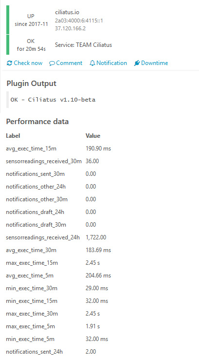

# check_ciliatus
Icinga 2 Plugin for Ciliatus

* Warning and critical thresholds for all execution times
* Performance data for all metrics

## Requirements

* Python 3

## Installation

* Copy `check_ciliatus` to the plugin directory (usually `/usr/lib/nagions/plugins`) and make it executable (`chmod +x check_ciliatus`)
* Include `check_ciliatus.conf` in your Icinga 2 configuration by either
  * placing it in Icinga 2's `conf.d` directory (usually `/etc/icinga2/conf.d`)
  * including it manually in your `icinga2.conf` (usually `/etc/icinga2/icinga2.conf`): `include "check_ciliatus.conf"`
* Create a user within your Ciliatus instance without any special permissions, generate an access token and store it in the `ciliatus_token_pass` variable on your service/service template

## Plugin output

